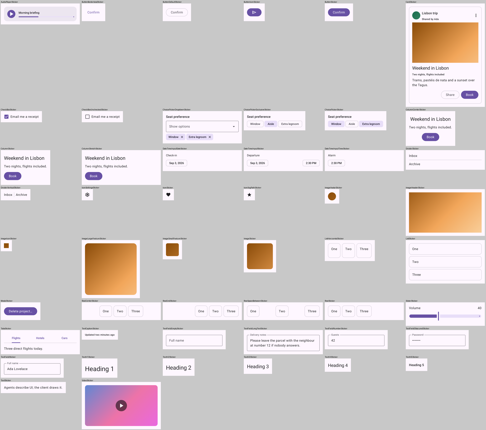
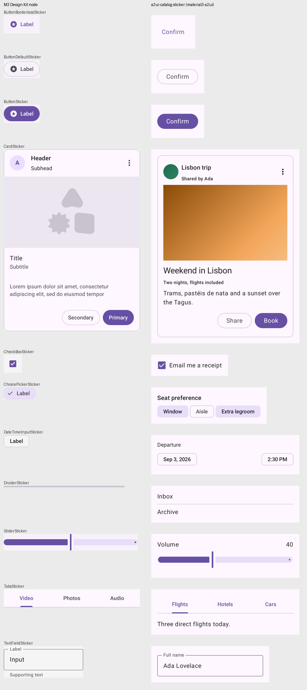
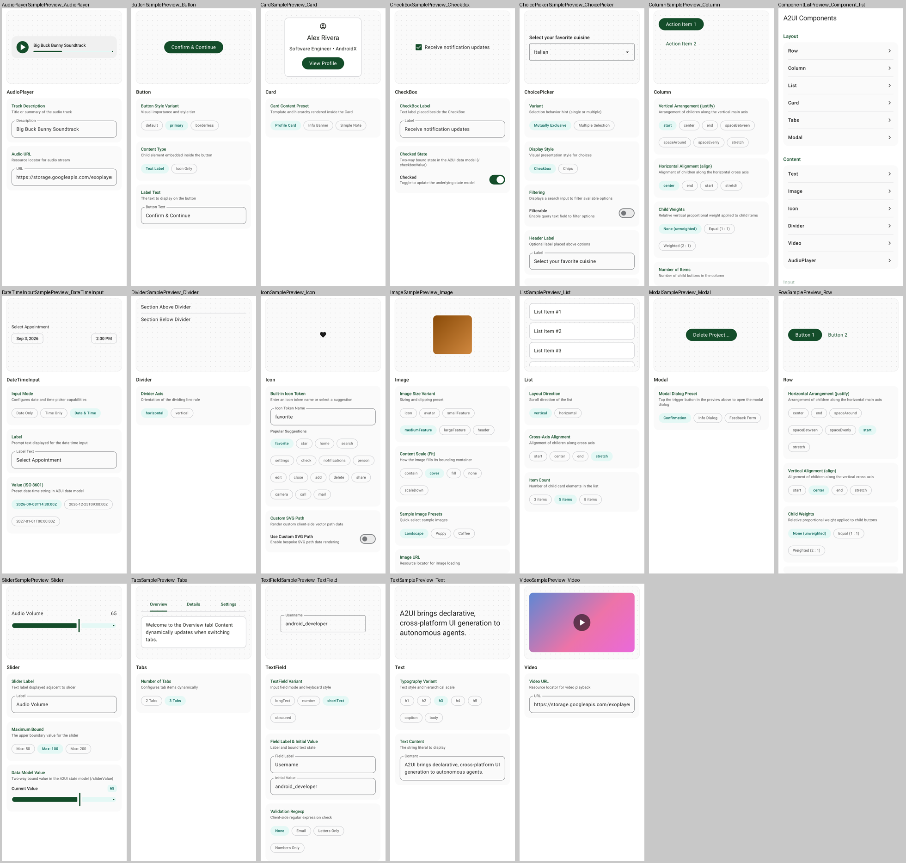
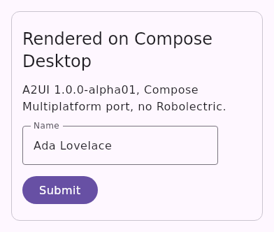
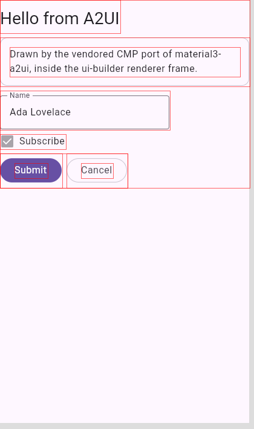

# A2UI basic catalog — as code

The [A2UI](https://a2ui.org) basic catalog (v0.9.1), as drawn by AndroidX's first A2UI release —
`androidx.compose.material3:material3-a2ui` **1.0.0-alpha01** (2026-09-23) — rebuilt as Jetpack
Compose `@Preview`s and published as an importable design catalog. The A2UI-side sibling of
[yschimke/m3-catalog](https://github.com/yschimke/m3-catalog) and
[yschimke/wear-m3-catalog](https://github.com/yschimke/wear-m3-catalog).

**Every sticker is a real A2UI payload.** Nothing here calls a Material composable to imitate an
A2UI component: each preview is the `updateComponents` list an agent would send, handed to the real
`A2uiMessageProcessor` and drawn by the real `A2uiSurface` with the Material 3 basic catalog. When
the library changes how it draws a component, the sheet moves.

## What is published

| Module | System | What it is | Delivery branch (`yschimke/a2ui-catalog-out`) |
| --- | --- | --- | --- |
| [`:catalog`](catalog) | `a2ui-catalog` | The 18 basic-catalog components, 50 stickers | `design-artifacts/a2ui-catalog` |
| [`:samples-catalog`](samples-catalog) | `a2ui-samples` | AndroidX's own A2UI sample screens, vendored | `design-artifacts/a2ui-samples` |
| [`:a2ui-harness`](a2ui-harness) | — | The synchronous surface host and deterministic media both sheets draw through | — |

Plus two generated files at the root:

- [`a2ui-basic-catalog.schema.json`](a2ui-basic-catalog.schema.json): the catalog's JSON Schema,
  exactly as the library advertises it to an agent (`A2uiCatalog.toJsonSchemaString()`), held to
  the library by `CatalogSchemaTest`.
- [`ui-builder.policy.json`](ui-builder.policy.json): the catalog as a UI-builder palette. Its
  18 `builtins` are projected from that schema by `scripts/ui-builder-policy.mjs`. A design built
  from it exports as A2UI JSON, not Kotlin, through the `a2ui-program` interpreter its
  `composeSourceExport` names.
- [`ui-builder/designs/`](ui-builder/designs): the New design chooser's starting points, named by
  the policy's `templates`: `a2ui-column` (the builder's built-in seed, frozen), `booking-card` and
  `contact-form`. Each uses only this palette, so it draws on the catalog's renderer runtime and
  exports. A UI builder reads them once it serves this catalog as catalog-owned
  (`--ui-builder-catalog-ownership`, compose-ui-builder's `UI_BUILDER_CATALOG_CUTOVER.md`).

## The components

Grouped the way the AndroidX demo groups them. The sticker id is the A2UI component name, and each
`variant`-like property is a cell of it, not a card of its own.

| Section | Components |
| --- | --- |
| Layout | `Row`, `Column`, `List`, `Card`, `Tabs`, `Modal` |
| Content | `Text`, `Icon`, `Divider`, `Image`, `Video`, `AudioPlayer` |
| Input | `Button`, `TextField`, `CheckBox`, `ChoicePicker`, `Slider`, `DateTimeInput` |

`CatalogInventoryTest` holds the sheet to the library: one card per basic-catalog component, and each
either names an M3 kit node or says why it has none.



## Figma: matched against the Material 3 Design Kit

There is no published A2UI Figma kit, and no A2UI library in Figma. What there is, is the thing
`material3-a2ui` draws *with*: Material 3. A Card is an `OutlinedCard`, `Tabs` a `PrimaryTabRow`,
a `primary` Button a filled `Button`, `default` an `OutlinedButton`, `borderless` a `TextButton`,
a chips `ChoicePicker` a row of `FilterChip`s, and a `DateTimeInput` at rest an `AssistChip`. So each
of those names the [M3 Design Kit][kit] node for that exact Material component, and
[`design-map.json`](design-map.json) (projected by `scripts/design-map.sh`) is the join.

Nine components and two Button cells are mapped. The other nine say why not (`noReference`): layout
primitives, media the app renders, text roles the kit publishes as styles, and a `Modal` whose
resting picture is only its trigger.



What the comparison already shows is recorded in [docs/FINDINGS.md](docs/FINDINGS.md).

Every Figma interaction is read-only (`.design-parity.json` says `design-led`, which makes
Code-to-Canvas push-back structurally impossible).

[kit]: https://www.figma.com/design/ocdacdEsnHipMJD3egzxKb/Material-3-Design-Kit--Community-

## The AndroidX samples

AndroidX ships its per-component A2UI samples not as `@Sampled` KDoc snippets but as the
`material3-a2ui` **integration-test demo**: each `<Component>Sample` is a control panel that composes
that component's payload. `:samples-catalog` vendors the demo at a pinned androidx-main commit
(`samples-catalog/import.json`) and renders every sample screen the way the demo lays it out: the
Material drawing of the payload in a dotted card, above the controls that produced it. See
[docs/design/ANDROIDX_SAMPLES.md](docs/design/ANDROIDX_SAMPLES.md).



## Why Robolectric

The whole A2UI stack (`androidx.a2ui:*`, `androidx.a2ui.compose:*`, `material3-a2ui`) is published
as Android AARs at `minCompileSdk` 37.1, with no Compose Multiplatform port. A desktop module
cannot put it on the classpath, so every sheet here is an AGP library rendered through Robolectric,
the same choice m3-catalog's Glimmer sheet made for the same reason. (The in-tree CMP port below is
a separate artifact; the sheets deliberately do not draw with it.)

## A Compose Multiplatform port, beside the sheets

[`vendor/`](vendor/README.md) carries the same 1.0.0-alpha01 sources compiled for Compose
Multiplatform (`jvm()` and `wasmJs`), so A2UI can render on the desktop JVM with Skiko and no
Robolectric. Upstream's `androidx.*` packages and bytes are kept; the Android and JDK surface they
touch goes through a narrow seam module, and every edit is listed in
[`vendor/README.md`](vendor/README.md). [`:a2ui-desktop`](a2ui-desktop) is the proof: a real
createSurface / updateComponents payload, parsed, applied and drawn by the vendored Material catalog
under Compose Desktop.



It publishes as `ee.schimke.a2uicmp:*:1.0.0-alpha01-cmp01` to the `a2ui-cmp-maven` branch of
`yschimke/a2ui-catalog-out`. The sticker sheets do **not** use it: they are evidence of what the
genuine AndroidX library draws, so they stay on the AARs until a desktop lane can be compared
against them.

## The UI-builder renderer runtime

[`a2ui-ui-builder-renderer/`](a2ui-ui-builder-renderer) is what the ui-builder's canvas draws an
A2UI design with. The editor cannot link the `material3-a2ui` AAR, so it loads this catalog's own
renderer, a Wasm page in an `<iframe sandbox="allow-scripts">` speaking the renderer SDK's
postMessage protocol. That page lowers the design with compose-ui-builder's `A2uiDocumentExporter`
(the same lowering the JSON export uses), applies the messages to the CMP port's engine, and draws
them with its Material 3 basic catalog. It reports every component's bounds so selection works.



It links the renderer SDK from a compose-ui-builder checkout, pinned by commit in
[`compose-ui-builder.ref`](a2ui-ui-builder-renderer/compose-ui-builder.ref), so the module exists
only when that checkout is named. The Design Artifacts workflow builds the ZIP and publishes it
beside `catalog.json` on `design-artifacts/a2ui-catalog`.

## Building

```
scripts/agent-gradle.sh :catalog:composePreviewRender          # the stickers
scripts/agent-gradle.sh :samples-catalog:composePreviewRender  # the sample screens
scripts/agent-gradle.sh test                                    # inventory, schema, synchronous host
node scripts/import-samples.mjs --check                         # vendored samples match upstream
node scripts/ui-builder-policy.mjs --check                      # policy matches the schema
scripts/agent-gradle.sh :a2ui-desktop:test                      # the CMP port renders on desktop
scripts/agent-gradle.sh publishA2uiCmpToBuildDir                # the port's Maven tree
scripts/agent-gradle.sh :a2ui-ui-builder-renderer:verifyRendererRuntime \
  -PcomposeUiBuilderDir=../compose-ui-builder                   # the UI-builder renderer ZIP
```

Needs an Android SDK with `platforms;android-37.1`.
